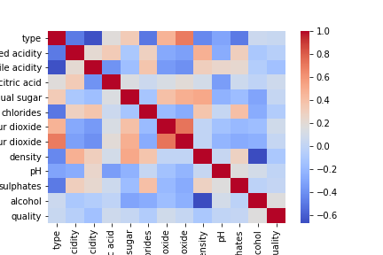
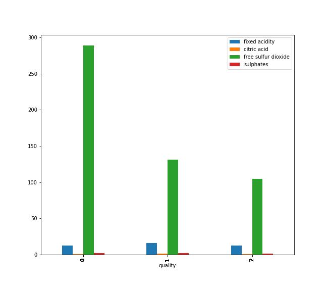

# wine_quality

# Challenge_Classification
challenge classification 

## Challenge

Use the Classification strategy to gather and preprocess data, Choose a model, Training it and evaluate it. And also use the Tuning of hyperparameters to make the best Machine Learning prediction.

## Duration
this challenge tooks 1 days

## Objectif

In this project, we learn to implement different classification algorithms in Python.    
At the end of the challenge, you will be able to:

    - Choose the most appropriate algorithm, depending on the problem.   
    - Know the know-how, way to implement and logic behind most common classifiers.   
    - Manipulate different type of data.   

## Proprocessing and Classification

the preprocess stood on some steps:   

    1- clean data (drop NaN and duplicate)   

    Shape initial = (6497, 13)   
    Shape after drops = (5295, 13)   

    2- look for correlation / relation   

    

 

    3- replace string columns into integer

    Quality Column:

    - from 1 to 4 : bad quality = 0   
    - from 5 to 7 : good quality = 1   
    - from 8 to 10 : high quality = 2   

    Type Column:

    - white = 1   
    - red = 0   

### 1- Classification : KNeighborsClassifier 

Score with defaults value:  
  * Train set: 0.931   
  * Test set:  0.922   

Score with best model:
  * Train set: 0.928     
  * Test set:  0.927    
  

## Author
This is an individual project to go deeper in this dataset.
So I do it lonely and you can also fork or download it for your own work.   

Feedbacks are always welcome ;)
